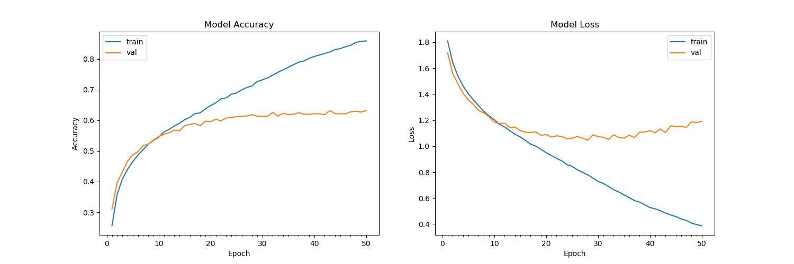

# Emotion-Detector

## Introduction

This project focuses on classifying facial emotions into one of **seven categories** using deep convolutional neural networks (CNNs). The model is trained on the **FER-2013** dataset, which was presented at the International Conference on Machine Learning (ICML). The dataset contains 35,887 grayscale face images, each 48x48 pixels in size, classified into **seven emotions**: angry, disgusted, fearful, happy, neutral, sad, and surprised.

## Dependencies

- Python 3
- [OpenCV](https://opencv.org/)
- [Tensorflow](https://www.tensorflow.org/)

To install the required packages, run:

```bash
pip install -r requirements.txt
```

## Basic Usage

This project is compatible with `tensorflow-2.0` and uses the Keras API from the `tensorflow.keras` library.

1. Clone the repository and navigate to the project folder:

```bash
git clone https://github.com/atulapra/Emotion-detection.git
cd Emotion-detection
```

2. Download the FER-2013 dataset and place it inside the `src` folder.

3. To train the model, run the following commands:

```bash
cd src
python emotions.py --mode train
```

4. If you want to use the pre-trained model without retraining, download it from [this link](https://drive.google.com/file/d/1FUn0XNOzf-nQV7QjbBPA6-8GLoHNNgv-/view?usp=sharing) and then execute:

```bash
cd src
python emotions.py --mode display
```

The folder structure should look like this:
- `src/`
  - `data/` (folder)
  - `emotions.py` (file)
  - `haarcascade_frontalface_default.xml` (file)
  - `model.h5` (file)

By default, the program detects emotions in all faces captured by the webcam. With a simple 4-layer CNN, the model achieved a test accuracy of 63.2% after 50 epochs.



## Data Preparation (Optional)

The [original FER2013 dataset on Kaggle](https://www.kaggle.com/deadskull7/fer2013) is available as a single CSV file. I have converted it into PNG images for training and testing purposes.

If you wish to experiment with new datasets in CSV format, I have provided a data preprocessing script, `dataset_prepare.py`, that you can reference.

## Algorithm

1. The **Haar Cascade** method detects faces in each frame from the webcam.
2. The facial region is resized to **48x48** pixels and fed into the CNN.
3. The network produces a list of **softmax scores** for the seven emotion classes.
4. The emotion with the highest score is displayed on the screen.

## References

- "Challenges in Representation Learning: A report on three machine learning contests." I Goodfellow, D Erhan, PL Carrier, A Courville, M Mirza, B Hamner, W Cukierski, Y Tang, DH Lee, Y Zhou, C Ramaiah, F Feng, R Li, X Wang, D Athanasakis, J Shawe-Taylor, M Milakov, J Park, R Ionescu, M Popescu, C Grozea, J Bergstra, J Xie, L Romaszko, B Xu, Z Chuang, and Y. Bengio. arXiv 2013.
